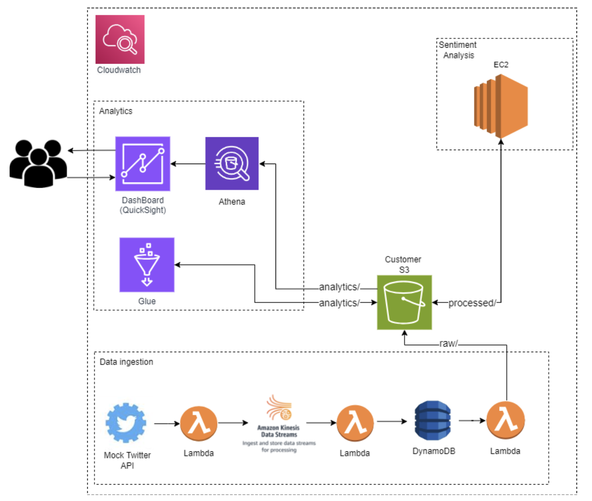

# Sentiment Analysis System
The goal of the project is creating a **big data analytics** pipeline for sentiment analysis. Using (mock) Twitter data, the system analyzes user sentiment towards different clients and their products to provide business insights. An additional constraint of the project was **complience**, i.e. proper treatment of clients' data. The project is implemented in **Python** using leveraging **AWS** infrastructure for easy scaling and **Docker** and **Terraform** for automation of the infrastructure. The sentiment analysis model development was not a part of this project, rather a pretrained model was used.

## Sources
HuggingFace pretrained model: https://huggingface.co/bhadresh-savani/distilbert-base-uncased-emotion  
Twitter data: Dataset: https://www.kaggle.com/datasets/kazanova/sentiment140

The system leverages Twitter API to gain insight into customers' feelings and thoughts towards a client company and/or product.
Main project functionalities:
1. Data Collection - using mock twitter API
2. Sentiment Analysis - using an **NLP** model
3. Data Visualization - interactive dashboarding for tracking sentiment trends over time and products
4. Workflow Automation - fully automated pipeline
   
## Architecture

- Twitter API is a mocked by a single **Lambda**.
- Data is ingested through **Amazon Kinesis Data Streams** and then consumed by multiple **Lambdas** (one per client) that filter only tweets relevant to that client.
- The filtered tweets are are stored as key-value pairs in **DynamoDB**.
- A final labmda stores all the combined data in an **S3** bucket for efficiently persisting the data.
- An **EC2** instance is responsible for the sentiment predictions.
- Tagged data is also stored in the **S3** bucket and processed using **AWS Glue**.
- The processed data is stored again in the **S3** bucket in **HDFS Parquet** format.
- The prepared data is queried by **AWS Athena**.
- The final data visualizations are made using **QuickSight**.
-  **CloudWatch** was integrated to enable efficient monitoring and debugging.

Further details are available in *FinalReport.pdf* and *ProjectOverview.pdf* files.
